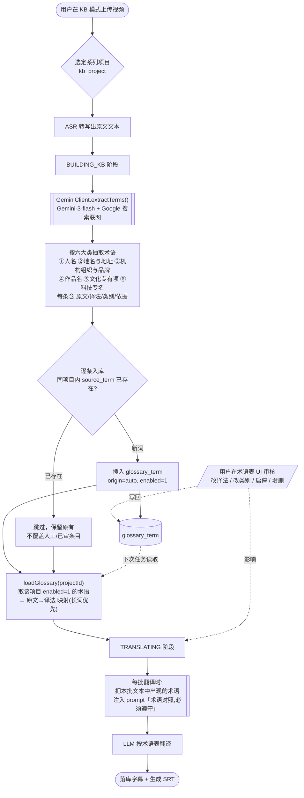

# 术语表（Termbase）流程图

> 仅描述「术语表」这条线：术语怎么产生、维护、并作用于翻译。
> 对应代码：`GeminiClient`、`TaskPipeline`(BUILDING_KB / TRANSLATING)、`KbService`、`KbController`、`KbMode.vue`、表 `kb_project` / `glossary_term`。

## 一、总览流程（Mermaid）



## 二、文字版分步

```
①  上传视频（KB 模式）→ 必须先选一个【系列项目】(kb_project)
        每个系列项目独立拥有一张术语表；同系列多个视频共用、逐步积累。

②  ASR 转写 → 得到整段原文文本。

③  BUILDING_KB（自动建术语）
        GeminiClient.extractTerms(transcript, 源语言, 目标语言, key)
        → 调本机 vertex2openai 代理的 gemini-3-flash-preview-search
        → 模型【联网 Google 搜索】核实权威译法（治"本多→本田"）
        → 按【六大类】产出： 人名 / 地名与地址 / 机构组织与品牌 /
          作品名 / 文化专有项 / 科技专名
        → 每条： {原文, 译法, 类别, 依据}

④  入库（upsertAutoTerms）
        逐条与本项目已有术语比对 source_term：
          · 已存在 → 跳过（不覆盖你改过的/人工的）
          · 新词   → 插入 glossary_term，origin=auto，enabled=1

⑤  人工审核（可选，随时）—— 术语表 UI
        改译法 / 选类别 / 启停(enabled) / 新增(origin=manual) / 删除
        改动写回 glossary_term，对【之后】的翻译任务生效。

⑥  TRANSLATING（套术语表翻译）
        loadGlossary：取本项目 enabled=1 的术语 → 原文→译法 映射
        每个翻译批次：只把【该批文本里出现的】术语对照写进 system prompt
        （"术语对照，必须严格按此翻译"）→ LLM 按表翻译。

⑦  出成果：落库字幕 + 生成 SRT（可继续烧录/特效）。
```

## 三、关键设计点
- **作用域**：术语表挂在「系列项目」上，一系列视频共用、越攒越准。
- **自动 + 人工**：Gemini 联网自动抽（origin=auto，标"待审"），你可改可删可加（origin=manual）；自动入库**不覆盖**你已维护的条目。
- **按需注入**：翻译时不是把整张表塞进去，而是只注入「当前这一批字幕里真正出现的」术语，省 token、可规模化。
- **长词优先**：映射按原文长度降序，避免短词误命中长词的一部分。
- **enabled 开关**：临时停用某条术语而不必删除。

## 四、第二期将增加（虚线表示尚未实现）
```
第一遍译文(SRT) ──▶ 交 Gemini 联网二次校正 ──▶ 对照网络复核重译 ──▶ 终稿
完整视频帧理解（File API）参与抽词；UI 精修。
```
